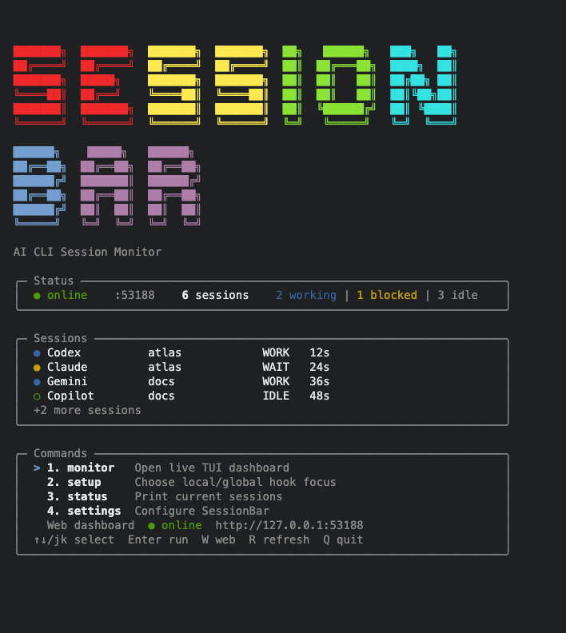
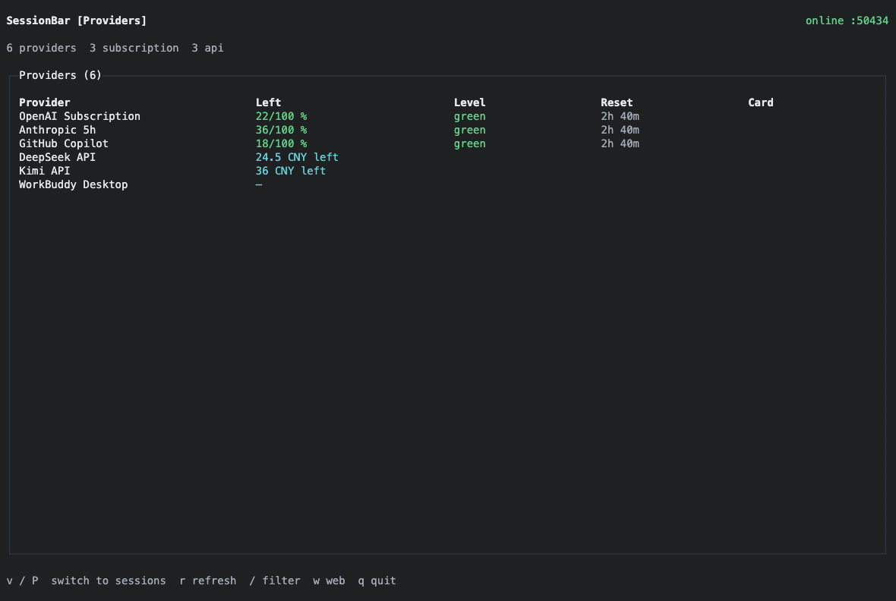
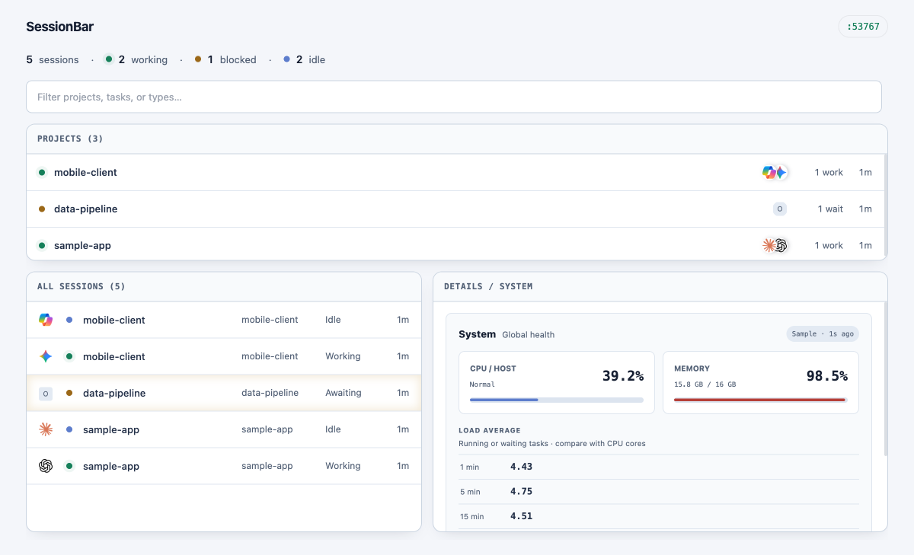
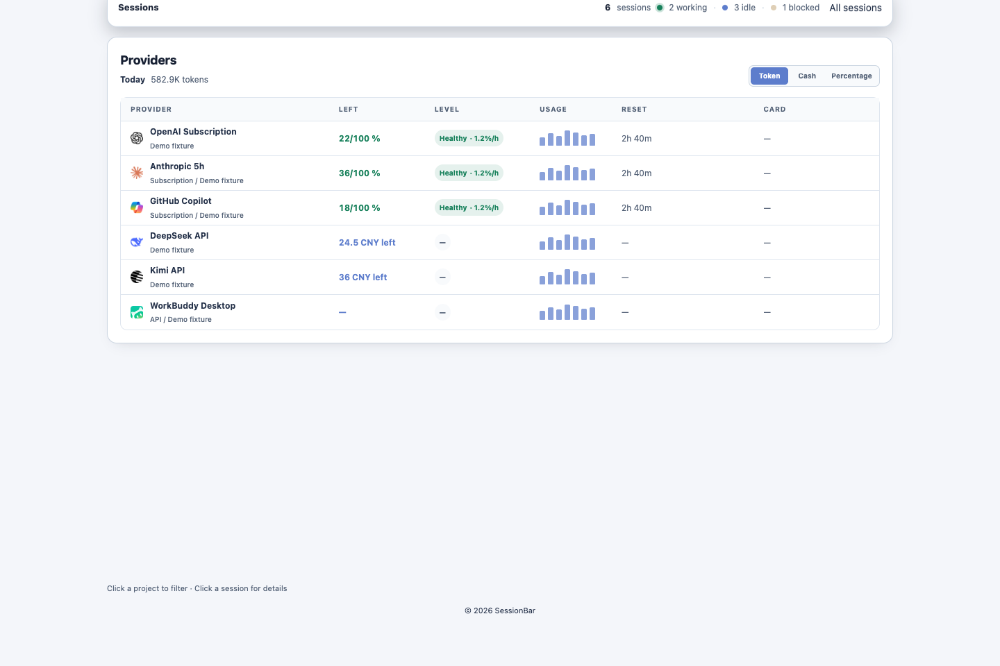

# SessionBar

**English** | [简体中文](README.zh-CN.md)

> [!IMPORTANT]
> SessionBar is still under active development. Some agents, status signals,
> and platform behaviors may not yet be fully covered. Feedback, suggestions,
> and reproducible issue reports from real-world use are highly appreciated.

SessionBar is a local-first dashboard for AI coding sessions. It discovers and
normalizes sessions from multiple agent harnesses, groups them by project
directory, and presents the result in a terminal UI or local Web dashboard.

One project can contain several concurrent Claude Code, Codex, OpenCode,
Gemini, or Copilot sessions. SessionBar keeps those sessions separate instead
of treating the project as a single agent process.

<table>
  <tr>
    <td width="50%" align="center"><br><sub><b>TUI · Landing</b></sub></td>
    <td width="50%" align="center"><br><sub><b>TUI · Providers</b></sub></td>
  </tr>
  <tr>
    <td width="50%" align="center"><br><sub><b>Web · Sessions</b></sub></td>
    <td width="50%" align="center"><br><sub><b>Web · Providers</b></sub></td>
  </tr>
</table>

> Screenshots use isolated sample projects, sessions, harnesses, and provider
> values. They do not contain local paths, account balances, credentials, or
> other user-specific data.

> SessionBar uses the terminal's background. Colors and contrast vary with the
> active terminal theme.

## Features

- Project-first navigation with per-project session lists and session details.
- Separate agent, session ID, task, status, freshness, context, and usage data.
- Overview, Activity, Usage, Flow, Raw, and System detail views.
- Claude Code, Codex, OpenCode, Gemini CLI, Copilot, and extensible hook support.
- Local provider quota and usage adapters without exposing credentials to the UI.
- Cached CPU, memory, load, temperature, and network telemetry.
- Stable alternate-screen rendering with slower polling while unfocused.
- One local relay per machine, using a dynamically selected loopback port.

## Requirements

- macOS or Linux
- Node.js 22 or newer
- npm
- Bun is recommended for the OpenTUI monitor runtime

## Installation

### Install from source

```sh
git clone <repository-url> sessionbar
cd sessionbar/0agentbar
npm install
npm run build
npm link
```

After `npm link`, the `sessionbar` command is available globally for the current
Node.js installation.

To run without linking:

```sh
npm install
npm run build
node dist/cli/cli.js
```

### Update a source installation

```sh
git pull
npm install
npm run build
```

## Quick Start

Start the interactive landing screen:

```sh
sessionbar
```

The application starts the local relay automatically. From the landing screen:

- `1` or `Enter`: open the live monitor
- `2`: choose local or global hook setup
- `3`: print current session status
- `4`: open SessionBar settings
- `W`: start or open the Web dashboard
- `Q`: quit

Open a view directly:

```sh
sessionbar monitor    # 实时终端面板 / Live terminal dashboard
sessionbar status     # 单次状态输出 / One-shot terminal status
sessionbar web        # 本地网页面板 / Local Web dashboard
sessionbar setup      # 配置 Hook 范围 / Configure hook scope
sessionbar harnesses  # 检查 Harness / Inspect supported harnesses
sessionbar prune      # 清理过期标记 / Remove stale markers
sessionbar stop       # 显式停止服务 / Explicitly stop the relay
```

The monitor uses project-first navigation:

1. Use `Up`/`Down` or `j`/`k` to select a project.
2. Press `Enter` to inspect that project's sessions.
3. Use `Up`/`Down` to select a session.
4. Use `[`/`]` or number keys to switch detail tabs.
5. Press Backspace or `a` to return to all projects, and `q` to exit.

## Hook Setup

Choose whether SessionBar should observe only the current project or all
projects on the machine:

```sh
sessionbar setup --local   # 当前项目 / Current project's .claude/settings.json
sessionbar setup --global  # 全局配置 / Global ~/.claude/settings.json
```

Hooks are activated when an interactive SessionBar app is opened. SessionBar
only removes hooks it manages. Hook requests use short timeouts, so an
unavailable relay does not block the agent harness.

The canonical reporting command is:

```sh
SESSIONBAR_AGENT=codex \
SESSIONBAR_SESSION_TYPE=Codex \
SESSIONBAR_PROJECT_DIR="$PWD" \
SESSIONBAR_SESSION_ID="agent-session-id" \
./report.sh working "Editing files" "$SESSIONBAR_PORT"
```

`report.sh` accepts `report.sh <status> <task_name> <server_port>`.

For an optional user-managed WorkBuddy balance adapter, set
`SESSIONBAR_WORKBUDDY_BALANCE_COMMAND` to a read-only command that prints
canonical JSON such as `{"remaining":2471,"used":2250.52,"unit":"credits"}`.
SessionBar validates that snapshot; without it, WorkBuddy's local database is
used only for consumption history and is never presented as account balance.

| Variable | Purpose |
| --- | --- |
| `SESSIONBAR_AGENT` | Stable lowercase agent key, such as `claude` or `codex` |
| `SESSIONBAR_SESSION_TYPE` | Human-readable agent label |
| `SESSIONBAR_PROJECT_DIR` | Absolute project directory |
| `SESSIONBAR_SESSION_ID` | Stable ID for one agent session |
| `SESSIONBAR_CONTEXT_PERCENT` | Optional context-window percentage |
| `SESSIONBAR_TOKENS` | Optional current token count |
| `SESSIONBAR_HOOK_EVENT` | Optional native lifecycle or tool event |

Legacy `AGENTBAR_*` variables remain accepted for existing installations.

## Runtime and Ports

SessionBar permits only one relay instance per state directory. By default the
relay binds to `127.0.0.1` on an available dynamic port, then writes the selected
port to `~/.sessionbar/port`.

The TUI, Web dashboard, hooks, and CLI read the same runtime state. To request a
specific port:

```sh
SESSIONBAR_PORT=8989 sessionbar
```

`SESSION_BAR_PORT` and `PORT` are accepted as compatibility aliases. A fixed
port is optional and can fail if another process already owns it.

## State Directory

Intermediate data is stored under `~/.sessionbar/`, never in the repository
root or a temporary system directory:

| Path | Content |
| --- | --- |
| `~/.sessionbar/port` | Current dynamic relay port |
| `~/.sessionbar/server.pid` | Relay process ID |
| `~/.sessionbar/server.log` | Relay diagnostics |
| `~/.sessionbar/sessions/` | Active hook marker files |
| `~/.sessionbar/settings.json` | User settings |
| `~/.sessionbar/provider-usage-history.json` | Provider usage samples |

Set `SESSIONBAR_HOME` to use an isolated state directory for development or
tests.

## Provider Data

Provider polling is independent from session status. Supported credentials are
read from environment variables or compatible local clients and are never sent
to the TUI, Web UI, session payloads, or logs.

Supported sources currently include OpenAI/Codex, Anthropic, GitHub Copilot,
DeepSeek, MiniMax, Kimi, xAI, and compatible CC Switch configurations. Provider
polling runs every five minutes by default:

```sh
SESSIONBAR_PROVIDER_POLL=0 sessionbar
SESSIONBAR_PROVIDER_POLL_MS=300000 sessionbar
```

The minimum interval is 30 seconds. Missing data remains unknown; SessionBar
does not estimate quota or account balance from session tokens.

## Performance Tuning

Session and system data poll every second while the TUI is focused. Rendering
occurs only when the visible model changes. Background terminal and browser
views automatically back off.

```sh
SESSIONBAR_TUI_POLL_MS=1000 sessionbar monitor
SESSIONBAR_TUI_REFRESH_MS=500 sessionbar monitor
SESSIONBAR_SYSTEM_SAMPLE_MS=2000 sessionbar monitor
```

## Development

```text
src/
  cli/        command entry and landing screen
  hooks/      harness setup and event normalization
  providers/  quota, subscription, and usage adapters
  server/     relay, runtime state, and settings
  sessions/   session identity, merge, retention, and details
  shared/     shared contracts and project utilities
  system/     host telemetry collectors
  tui/        OpenTUI monitor and transport
  web/        browser dashboard
public/       Web entry document and styles
test/         Node.js test suite
```

Build and test:

```sh
npm run build
npm test
```

Before opening a pull request:

1. Keep state under `~/.sessionbar` or an isolated `SESSIONBAR_HOME`.
2. Add focused tests for behavior changes.
3. Run `npm test` and confirm all tests pass.
4. Preserve unknown provider fields as unavailable instead of guessing.
5. Keep project identity and session identity separate.

## Contributions

Code contributions, bug reports, reproducible performance traces, and harness
adapter improvements are welcome. By contributing, you agree that your changes
may be distributed under the project's MIT License.

## Related Work and Direction

Several independent projects address adjacent parts of the coding-agent
workspace. They are listed here to describe the field and SessionBar's
position in it, not to claim that their implementations were used as references:

| Project | Primary focus |
| --- | --- |
| [Orca](https://github.com/stablyai/orca) | Running and steering a fleet of coding agents across desktop, mobile, and remote environments. |
| [abtop](https://github.com/graykode/abtop) | Real-time terminal observability for agent sessions, context, tokens, limits, and processes. |
| [Mole](https://github.com/tw93/mole) | A polished command-line interface for local system maintenance and monitoring. |
| [Rezi](https://github.com/RtlZeroMemory/Rezi) and [OpenTUI](https://github.com/anomalyco/opentui) | TypeScript frameworks for building stateful terminal applications. |

SessionBar's long-term direction is a local, low-overhead control surface for
every coding-agent session on a machine: independent of the harness that owns
the session, organized by project, private by default, and available through
both terminal and Web interfaces. It should make sessions easy to discover,
observe, compare, focus, and resume without taking ownership of how each agent
executes its work.

The projects above are independent. Their inclusion does not imply dependency,
affiliation, endorsement, or code derivation.

## License

SessionBar is released under the [MIT License](LICENSE). Third-party packages
remain subject to their own licenses and copyright notices.
