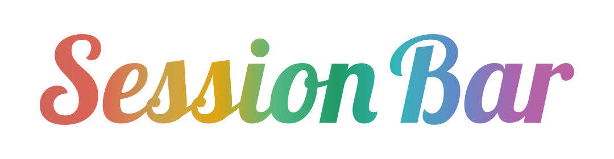
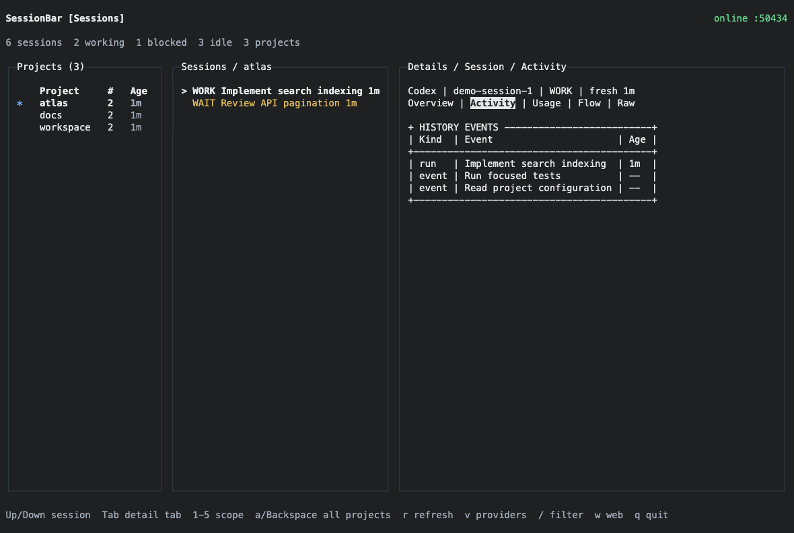

<p align="center">
  
  <br>
  <sub>AI CLI Session Monitor</sub>
</p>

[English](README.md) | **简体中文**

## 最新动态

- **2026-10-07 · 修复：** 三栏 TUI 排版、Setup 单键选择与取消、Provider 缓存过期及禁用轮询。
- **2026-10-07 · 加固：** 本地浏览器请求边界、私有状态写入及兼容版本依赖更新。
- **2026-10-07 · 更新：** 双语文档、脱敏截图和 SVG 字标。
- **2026-09-01 · 修复：** Workflow 事件仅展示，不覆盖明确的 Session 数据。

> [!IMPORTANT]
> SessionBar 目前仍在持续完善中，部分 Agent、状态识别和平台行为可能尚未完全覆盖。
> 欢迎在实际使用后提交问题、建议和可复现的反馈，帮助项目改进。

SessionBar 是一个本地优先的 AI 编程会话监控工具。它从不同 Agent
Harness 中发现并规范化会话，按项目目录组织数据，并通过 TUI 或本地 Web
界面展示。

同一个项目可以同时包含多个 Claude Code、Codex、Gemini、Copilot 或 WorkBuddy
会话。SessionBar 会分别跟踪每个会话，而不是将整个项目误认为单个
Agent 进程。

### 支持的 Harness

<p>
  <kbd> Claude Code</kbd>
  <kbd> Codex</kbd>
  <kbd> Gemini CLI</kbd>
  <kbd> GitHub Copilot CLI</kbd>
  <kbd> Claude Desktop</kbd>
  <kbd> WorkBuddy Desktop</kbd>
</p>

<table>
  <tr>
    <td colspan="2" align="center"><br><sub><b>TUI · 首页</b></sub></td>
  </tr>
  <tr>
    <td width="50%" align="center"><br><sub><b>TUI · 会话</b></sub></td>
    <td width="50%" align="center"><br><sub><b>TUI · Providers</b></sub></td>
  </tr>
  <tr>
    <td width="50%" align="center"><br><sub><b>Web · 会话</b></sub></td>
    <td width="50%" align="center"><br><sub><b>Web · Providers</b></sub></td>
  </tr>
</table>

> 截图于 2026-10-07 根据本次发布的实际 UI 生成，使用隔离的模拟项目、会话、系统指标和
> Provider 数值，不包含真实账户数据、凭据或个人路径。缺失字段仍显示为不可用；
> 实际数据覆盖范围取决于 Harness 和 Provider Adapter。

> SessionBar 使用终端自身的背景色；实际颜色和对比度会随终端主题变化。

## 功能

- 项目路径 → Session → Details；每个 Agent 会话保持独立。
- Overview、Activity、Usage、Flow、Raw 详情；未选择项目时展示系统状态。
- Provider 配额、余额、趋势与 Session 状态分离。
- 缓存 CPU、内存、负载、温度和网络读数。
- Alternate-screen TUI 渲染和后台降频。
- 每个状态目录一个 Relay，启动时动态分配端口。

## 安装与更新

需要 **Node.js 22+、npm 和 Bun**。Node 运行 CLI、Landing 和 Relay；OpenTUI
Monitor 需要 Bun 原生 FFI。macOS 是主要测试平台；Linux 部分支持，部分桌面发现、
凭据和温度 Adapter 仅支持 macOS。当前不承诺 Windows 功能对等。

```sh
git clone https://github.com/Guojiacheng2017/SessionBar.git sessionbar
cd sessionbar
npm install
npm run build
npm link
sessionbar
```

无需全局链接时运行 `node dist/cli/cli.js`。源码安装更新：依次执行
`git pull`、`npm install`、`npm run build`。

## 使用

Landing 自动启动 Relay。用上下方向键或 j/k 选择，Enter 执行。
快捷键：`1` Monitor、`2` Setup、`3` Status、`4` Settings、`W` Web、`Q` 退出。

```sh
sessionbar monitor    # 实时终端面板 / Live terminal dashboard
sessionbar status     # 单次状态输出 / One-shot status
sessionbar web        # 本地网页面板 / Local Web dashboard
sessionbar setup      # 配置 Hook 范围 / Configure hook scope
sessionbar harnesses  # 检查 Harness / Inspect harness availability
sessionbar prune      # 清理过期标记 / Remove stale markers
sessionbar stop       # 显式停止服务 / Explicitly stop the relay
```

Monitor 中先上下选择项目并 Enter，再上下选择其中的 Session。
Tab、方括号或 `1`–`5` 切换详情，`a` 或 Backspace 返回全部项目，
`v` 切换 Providers、`r` 刷新、`/` 过滤、`w` 打开网页、`q` 退出。
未聚焦项目时显示全部 Session。Web 中点击项目和会话，向下滚动进入 Providers。

退出 TUI 不会关闭浏览器标签或停止后台 Relay；执行 `sessionbar stop` 显式停止。
正常刷新不会重新分配运行中 Relay 的端口。

### Hook 与发现

```sh
sessionbar setup --local   # 当前项目 / Current project
sessionbar setup --global  # 所有项目 / All projects
```

交互应用激活 SessionBar 管理的 Hook；单次 Status 不安装 Hook。Harness 可能需重启
加载配置。Claude Code、Gemini CLI、Copilot 使用 Hook；Codex 另有本地日志和 App
Server 元数据。Claude Desktop、WorkBuddy 使用本地 Registry 发现，不注入 Desktop
Hook。本次不包含 OpenCode 发现和 Pi Extension。

自定义上报：

```sh
SESSIONBAR_AGENT=codex \
SESSIONBAR_SESSION_TYPE=Codex \
SESSIONBAR_PROJECT_DIR="$PWD" \
SESSIONBAR_SESSION_ID="agent-session-id" \
./report.sh working "Editing files"
```

`report.sh <status> <task_name> [server_port]` 在省略端口时读取状态目录。
Session ID 必须标识独立会话，不能仅标识项目。可选字段包括
`SESSIONBAR_CONTEXT_PERCENT`、`SESSIONBAR_TOKENS`、`SESSIONBAR_HOOK_EVENT`。
保留对旧 `AGENTBAR_*` 变量的兼容。

## 运行状态与存储

默认绑定 **127.0.0.1** 的可用端口，记录于 `~/.sessionbar/port`。同目录包含
`server.pid`、`server.log`、`sessions/`、`settings.json`、
`provider-usage-history.json`、`provider-last-good.json`、`session-usage-history.json`。

```sh
SESSIONBAR_PORT=8989 sessionbar             # 可选固定端口 / Optional fixed port
SESSIONBAR_HOME="$HOME/.sessionbar-dev" sessionbar  # 独立状态 / Isolated state
```

`SESSION_BAR_PORT`、`PORT` 为兼容别名。显式端口被占用时可能启动失败。
状态和中间数据不应写入仓库。Session 无更新时在内存保留最多 30 分钟，
列表并非永久对话档案。

POSIX 状态目录权限为 `0700`，更新后的状态文件为 `0600`。
这不是加密，也无法阻止同一用户身份的其他进程读取。

## Provider 数据

Adapter 包括 OpenAI/Codex、Anthropic、GitHub Copilot、DeepSeek、MiniMax、
Kimi、xAI 及兼容 CC Switch 配置，覆盖取决于凭据和上游接口。
不会从 Session Token 猜测缺失的账户配额。

[CC Switch](https://github.com/farion1231/cc-switch) 是可选只读集成，提供兼容凭据和
七天 API Token 历史。没有它也能运行监控和官方 Adapter。DeepSeek、Kimi 可使用
`SESSIONBAR_DEEPSEEK_API_KEY`、`SESSIONBAR_KIMI_API_KEY`。
WorkBuddy 可配置只读 `SESSIONBAR_WORKBUDDY_BALANCE_COMMAND` 输出校验后的余额 JSON。

```sh
SESSIONBAR_PROVIDER_POLL=0 sessionbar
SESSIONBAR_PROVIDER_POLL_MS=300000 sessionbar
```

默认五分钟采集，最短 30 秒。成功 Provider 数据最多保留 30 天；刷新失败显示
最后数值、原采集时间和 stale 标记，不续期。关闭轮询后仍可读取缓存，但不调用
订阅或 API Adapter。

## 隐私与安全

本次仅支持 Loopback HTTP，不要通过公共代理或端口转发暴露 Relay。浏览器请求
校验可信 Host 和同源 Origin。设备配对、LAN 网关和远程遥测不在本次发布中。

项目路径、标题和 Activity 可能包含私人信息，本地客户端可以看到。
Provider 凭据不返回 UI Payload。上游接口、外部 Icon 会产生网络请求。
可选 `--icloud` 将 Session 快照导出到用户 iCloud 目录。

本次生产依赖通过 `npm audit --omit=dev`，但不代表全面安全审计或能防御恶意
本地进程。不要提交凭据、个人配置或真实快照。

## 开发

源码按职责位于 `src/cli`、`hooks`、`providers`、`server`、`sessions`、
`shared`、`system`、`tui`、`web`；资源在 `public/`，测试在 `test/`。
截图与字标工具说明见 [scripts/docs/README.md](scripts/docs/README.md)。

```sh
npm run build
npm test
```

添加回归测试，状态放在仓库外，保留未知值，并区分项目与 Session 身份。
实验中的费用、原生伴随应用及光学配对不在本次更新内。

## 贡献

欢迎提交代码、Bug Report、可复现的性能数据以及 Harness Adapter 改进。
提交贡献即表示同意相关修改可按本项目的 MIT License 发布。

## 前任工作与方向

[Orca](https://github.com/stablyai/orca)、[abtop](https://github.com/graykode/abtop)、
[Mole](https://github.com/tw93/mole)、[Rezi](https://github.com/RtlZeroMemory/Rezi)、
[OpenTUI](https://github.com/anomalyco/opentui) 探索了相邻的 Agent、终端与系统监控问题。
此列表说明领域背景，不代表代码借用、关联或背书。SessionBar 的方向是低开销、
隐私优先、按项目组织的全机编程 Agent 会话视图。

## 许可证

[MIT License](LICENSE)。第三方资源保留各自许可证。
Bundled Splide 和 README 字标字体归属见 [第三方声明](docs/THIRD_PARTY_NOTICES.md)。
