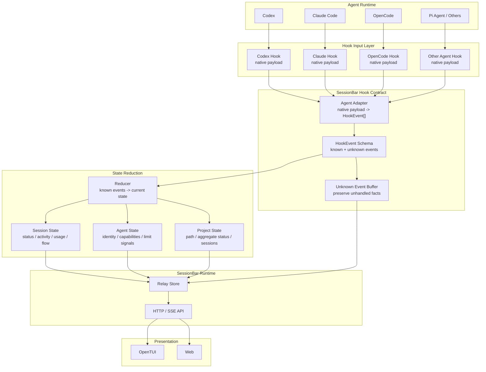

# SessionBar Hook Input Contract Design

Date: 2026-06-24

## Purpose

SessionBar depends on hooks as its primary design input layer. Every supported agent should be able to report state through a hook, even though each agent has its own native hook payload shape and event vocabulary.

The goal is to define an event-first input contract:

```text
Agent Runtime -> Agent Hook -> Adapter -> HookEvent[] -> Reducer -> Canonical State -> UI
```

Other sources such as JSONL, transcripts, logs, or process scans may enrich state later, but they are not the primary input source for this contract.

## Core Constraints

- Hooks are the main input boundary for all agents.
- SessionBar has no model intelligence.
- Each adapter must be deterministic and testable.
- The UI reads canonical state and event buffers, not agent-specific payloads.
- Unknown or unsupported hook facts are preserved as events instead of being guessed or discarded.
- Missing facts render as unknown placeholders, not inferred values.
- Provider or account limits are not session usage unless the hook explicitly reports them as agent-level facts.

## Architecture



## Hook Event Model

Hooks emit native payloads. SessionBar adapters normalize those payloads into `HookEvent[]`.

Known event families:

- `session_status`: session lifecycle and current state.
- `activity_event`: user, agent, tool, and command activity.
- `usage_snapshot`: session-local token usage and context pressure.
- `flow_event`: structured workflow nodes or edges when the source provides them.
- `agent_signal`: agent-level identity, capability, or provider-reported limit signal.
- `project_signal`: project identity or project-level aggregation hint.
- `unknown`: preserved native facts that SessionBar does not yet understand.

Every event should carry enough routing metadata to attach it to the right scope:

- `agent_type`
- `session_id` when available
- `project_path` or `project`
- `timestamp`
- `source`
- raw payload reference or compact raw payload

## State Scopes

### Session Facts

Session facts describe the monitored unit the user focuses in the sidebar.

Examples:

- status: idle, working, blocked, error
- activity tail
- running or completed tool label
- token usage: input, output, cache read, total
- token rate calculated from session-local usage deltas
- context pressure
- flow nodes and edges when hooks provide enough structure

Session token usage means this session used these tokens. It does not mean the account or provider is near a limit.

### Agent Facts

Agent facts describe the current agent integration, not a single session.

Examples:

- agent type and display name
- hook capabilities
- provider or model identity
- provider-reported limit signals when available
- agent liveness signals

Provider limit signals are optional and may be absent for local or API-based agents. SessionBar must not infer quota exhaustion from missing data.

### Project Facts

Project facts describe the project grouping.

Examples:

- project path and display name
- active session ids
- aggregate status counts
- latest known activity across sessions

Project aggregation is derived from session and agent facts unless a hook explicitly provides better project-level data.

## Reducer Rules

The reducer consumes known `HookEvent` types and updates canonical state.

Rules:

- Reducers are deterministic pure functions where practical.
- Unknown events are stored for Activity, Flow, or Raw display, but do not block state updates.
- Later events for the same scope can update earlier state.
- Missing fields do not clear previous known facts unless the event explicitly says the fact is cleared.
- Snapshot compatibility is allowed: current `SessionPayload` fields can be treated as a legacy snapshot input and converted into equivalent events.

For `usage_snapshot`, the reducer may derive:

```text
tokens = total_tokens
input_tokens = input_tokens
output_tokens = output_tokens
cache_read_tokens = cached_input_tokens
context_percent = total_tokens / model_context_window * 100
token_rate = delta(total_tokens) / delta(timestamp)
```

`token_rate` is session-local token velocity. It must not come from provider rate-limit data.

## Adapter Rules

Adapters translate native hook payloads into canonical events.

Rules:

- Adapters may parse structured hook payloads.
- Adapters should not parse natural-language agent text as state.
- Adapters should emit `unknown` events for useful native payload parts that do not yet map to a known event.
- Adapters should not directly update UI state.
- One adapter module may contain multiple agent adapters at first to avoid backend file sprawl.

Initial adapter targets:

- Codex hook payload to `usage_snapshot`, `activity_event`, and `session_status` when available.
- Claude Code hook payload to `session_status`, tool activity, and stop/session-end events.
- OpenCode and other agents can start with `session_status` and `unknown` until richer hook facts are known.

## UI Rules

- Overview reads current canonical session state.
- Activity reads recent known activity events.
- Usage reads reducer-derived session usage fields.
- Flow reads known flow events and falls back to event lists.
- Raw can show raw payloads and unknown events.
- Agent-level provider limit signals should not appear as session quota unless the UI is explicitly focused on agent-level state.

## Non-Goals

- Using Codex JSONL, Claude transcript, logs, or process scans as primary hook input.
- Implementing provider quota or account exhaustion detection in the session inspector.
- Inferring workflow structure from natural language.
- Building the final visual Flow graph.
- Splitting every agent into a separate backend file before the contract is stable.

## Testing Implications

Implementation should include tests for:

- Adapter converts native hook payloads into `HookEvent[]`.
- Unknown native fields are preserved as `unknown` events.
- Reducer converts `usage_snapshot` into session-local usage fields.
- Reducer calculates `token_rate` from session-local usage deltas.
- Provider rate-limit payloads are stored as agent-level signals, not session usage.
- Legacy snapshot payloads still produce the same current `SessionPayload` behavior.
- UI rendering remains stable when fields are missing.
